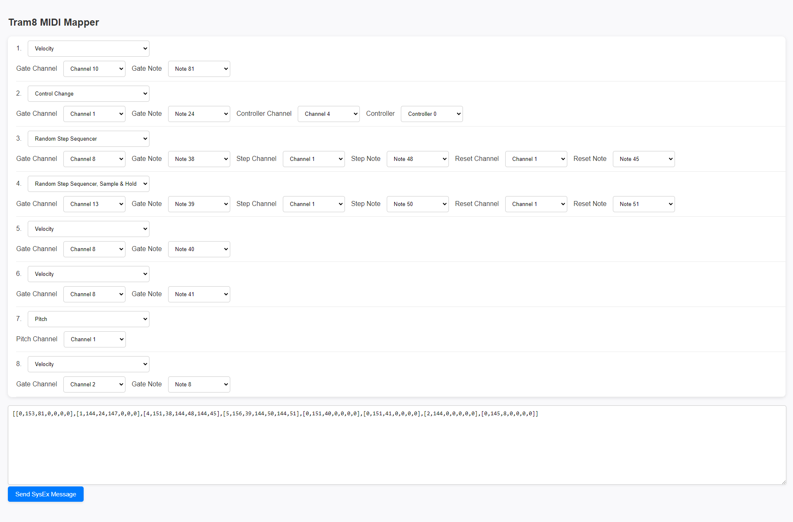

# Custom Firmware

  

## MIDI Modes

This firmware allows each of the 8 Gate-CV pairs to be programmed individually with any of 6 MIDI modes. A MIDI Map stores the conditions for the Gate-CV pairs so that MIDI messages can be passed correctly during play. Any MIDI channel can be used, however it's in most cases best for triggers to not match and Pitch values to come from unqiue channels (more details in MIDI Learn). 

| **MIDI Mode**                               | **Gate Style** | **Gate Condition**                                           | **CV**                                                                                                                        |
|---------------------------------------------|----------------|--------------------------------------------------------------|------------------------------------------------------------------------------------------------------------------------------|
| **1. Velocity**                             | Drum Pad       | Note message matching trigger condition (Channel & Pitch).   | Velocity of the Note message.                                                                                                   |
| **2. Control Change**                       | Drum Pad       | Note message matching trigger condition (Channel & Pitch).   | Value from a Control Change (CC) message with matching CC condition (Channel & Controller Number).                              |
| **3. Pitch**                                | Keyboard       | Note message matching trigger condition (Channel).           | Pitch (5 octave range) of the Note message.                                                                                     |
| **4. Pitch, Sample & Hold**                 | Drum Pad       | Note message matching trigger condition (Channel G & Pitch). | Pitch value (Note message on Channel P) is held in buffer. Gate trigger (Channel G) updates CV from the stored buffer.          |
| **5. Random Step Sequencer\***                | Drum Pad       | Note message matching trigger condition (Channel & Pitch S). | NoteOn message with Step condition (Channel & Pitch S) updates the CV output with a new sequence value. NoteOn message with Reset condition (Channel & Pitch_R) resets the Random Sequence. |
| **6. Random Step Sequencer\*, Sample & Hold** | Drum Pad       | Note message matching trigger condition (Channel & Pitch G). | Similar to Random Step Sequencer, however the new random value from the Step Sequence is sampled when a Gate Condition is triggered. |

### *Random Step Sequencer

New sequences can be generated with a short-press of the button on the Tram8. Without a Reset trigger the sequence will go on seemingly indefinitely, this is because the random step sequencer uses a Pseudo Randum Number Generator (PRNG) to generate new values. This is a deteministic process, although the values will be percieved as a random sequence after an update. The initial values, or seeds, are kept in memory. Reset triggers will simply copy these seeds to reset the PRNG process, making it repeat. A different PRNG algorithm is used to update the seed when the button is pressed, updating with the same alogirthm would just 'shift' the sequence.

## Menu

To access the Menu hold down the button on the Tram8 for about a second until the first Gate illuminates. Once in Menu MIDI messages will cease to be outputted from all Gates and CV outputs. The illuminated Gate indicates where you are in the Menu below, you can cycle through the options with a short press and enter/execute the selected option with a hold press. Since MIDI Learn is the first option, a long hold of the button will put you into MIDI Learn mode - you will see the first Gate turn on then off.

### 1. MIDI Learn

Once entered, you will be able to program the Tram8 with your own MIDI mappings.

- You can cycle through learning each MIDI type with a short press of the button. The LED will blink a count then pause on repeat, indicating the MIDI Mode you are learning (as shown in the table below).
- Once a Gate-CV pair has been successfully completed, it will illuminate.
- Depending on the MIDI Mode, you will need to transmit 1-3 appropriate MIDI messages to the Tram8 to complete the mapping for that Gate-CV pair (details in the table below).
- If you have not transmitted all the required MIDI messages, a short press of the button will reset the learning for the Gate-CV pair and return to learning the Velocity mode.
- You can exit MIDI Learn at any time by holding the button down; all Gate lights will briefly turn on to indicate exiting.
- Completing or exiting MIDI Learn will not automatically save the mapping. Saving must be done manually from the Menu. This allows you to test your new mapping and mitigates the risk of mistakes. If you're unhappy with the mapping, you can load from the Menu or restart the module with a power cycle.

| **Learning MIDI Mode**                           | **Number of Messages Required** | **Message Details**                                                                                   |
|-----------------------------------------|---------------------------------|-------------------------------------------------------------------------------------------------------|
| **1. Velocity**                            | 1                               | 1 NoteOn message for the Gate.                                                                        |
| **2. Control Change**                      | 2                               | 1 NoteOn message for the Gate followed by a CC message.                                               |
| **3. Pitch**                               | 1                               | Only 1 NoteOn message. This is best on a unique channel, but it can be any note.                      |
| **4. Pitch, Sample & Hold**                | 2                               | 1 NoteOn message for the Gate followed by 1 NoteOn message for Pitch, preferably on a unique channel. |
| **5. Random Step Sequencer**               | 3                               | 1 NoteOn message followed by 2 NoteOn messages for both Step and Reset.                               |
| **6. Random Step Sequencer, Sample & Hold**| 3                               | 1 NoteOn message followed by 2 NoteOn messages for both Step and Reset.                               |

### 2. Save MIDI Map

Saves the MIDI Mapping in memory to the storage chip.

### 3. Load MIDI Map

Loads the MIDI Mapping into memory from the storage chip.

### 4. Copy Preset (Beat Step Pro)

Copies the MIDI Mapping from the Preset into memory. This will not be saved.

|| **MIDI Mode**                          | **Conditions**                                                                                       |
|-|---------------------------------------|------------------------------------------------------------------------------------------------------|
|1| Random Step Sequencer, Sample & Hold  | Channel 8 (Drum Sequencer default), Gate C0 (Label C), Step G#0 (Label C#1), Reset A0 (Label D#).    |
|2| Random Step Sequencer, Sample & Hold  | Channel 8 (Drum Sequencer default), Gate C#0 (Label D), Step A#0 (Label None), Reset B0 (Label F#).  |
|3| Random Step Sequencer                 | Channel 8 (Drum Sequencer default), Gate D0 (Label E), Step C1 (Label G#), Reset C#1 (Label A#).     |
|4| Random Step Sequencer                 | Channel 8 (Drum Sequencer default), Gate D#0 (Label F), Step D1 (Label OCT-), Reset D#1 (Label OCT+).|
|5| Velocity                              | Channel 8 (Drum Sequencer default), Gate E0 (Label G).                                               |
|6| Velocity                              | Channel 8 (Drum Sequencer default), Gate F0 (Label A).                                               |
|7| Pitch                                 | Channel 1 (Sequencer 1 default).                                                                     |
|8| Pitch                                 | Channel 2 (Sequencer 2 default).                                                                     |

### 5. SysEx MIDI Map

The Tram8 will wait for SysEx messages that indicate the mapping. The tool in the `js` subdirectory can be used to create mappings and send them to the device. To use this, once the repository is cloned simply open `index.html` in your browser. You will need to use a browser that supports sending MIDI or SysEx, but there are a few that do e.g., Chrome.

  

### 6. Exit

Exits the Menu back to ordinary play function.
